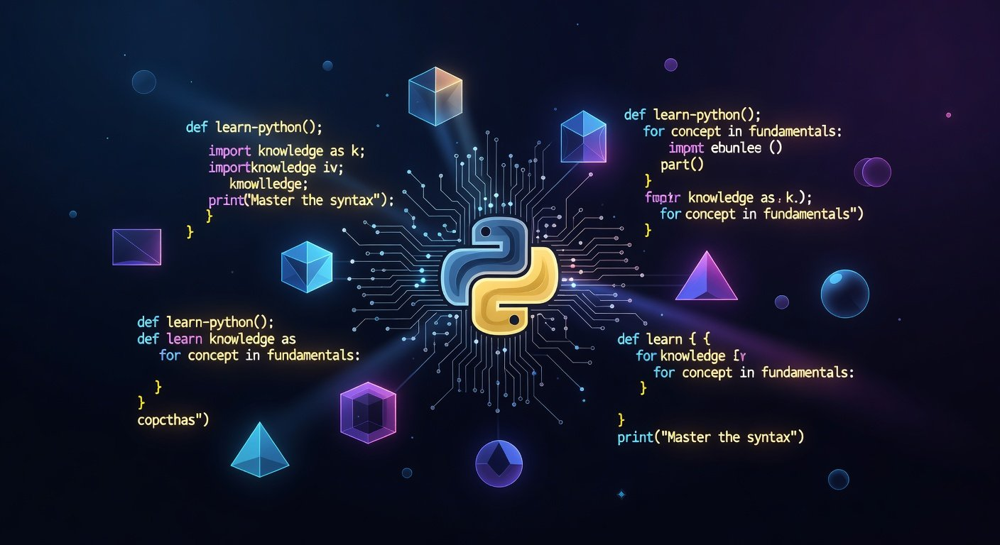

# 🐍 PyMaster — Plateforme d'Apprentissage Python Premium

<div align="center">
  
  
  **La plateforme interactive pour maîtriser Python de zéro à héros**
  
  [](https://pages.github.com/)
  [](/)
  [](LICENSE)
</div>

---

## 📋 Table des Matières

- [Présentation](#-présentation)
- [Fonctionnalités](#-fonctionnalités)
- [Architecture](#-architecture)
- [Modules de Formation](#-modules-de-formation)
- [Système d'Exercices](#-système-dexercices)
- [Projets Guidés](#-projets-guidés)
- [Gamification](#-gamification)
- [Installation](#-installation)
- [Déploiement](#-déploiement)
- [Technologies](#-technologies)
- [Contribution](#-contribution)

---

## 🎯 Présentation

**PyMaster** est une plateforme d'apprentissage Python **100% statique** conçue pour être hébergée sur GitHub Pages, Netlify, Vercel ou tout autre hébergement statique.

### Philosophie

- ✅ **Aucun backend requis** — Tout fonctionne côté client
- ✅ **Exécution de code en direct** — Grâce à Pyodide (Python dans le navigateur)
- ✅ **Progression sauvegardée localement** — Via LocalStorage
- ✅ **Gratuit et accessible** — Aucune inscription nécessaire
- ✅ **Projets exécutables localement** — Avec Python installé sur votre machine

### Public Cible

- 🎓 **Débutants absolus** — Aucune connaissance préalable requise
- 💼 **Reconversion professionnelle** — Parcours structuré vers l'emploi
- 🎮 **Passionnés** — Créez vos propres projets et jeux
- 📊 **Data Scientists en herbe** — Bases solides pour aller plus loin

---

## ✨ Fonctionnalités

### 📚 Contenu Pédagogique Premium

| Fonctionnalité | Description |
|----------------|-------------|
| **12 Modules Complets** | De l'installation à la programmation avancée |
| **60+ Leçons Détaillées** | Explications claires avec exemples |
| **150+ Exemples de Code** | Commentés et expliqués ligne par ligne |
| **Quiz Interactifs** | Validation des connaissances après chaque module |
| **Projets Pratiques** | 10+ projets concrets à réaliser |

### 💻 Éditeur de Code Intégré

```
┌─────────────────────────────────────────────────────────┐
│  📝 Éditeur Python                              [▶ Run] │
├─────────────────────────────────────────────────────────┤
│  1 │ # Votre code Python ici                           │
│  2 │ print("Hello, PyMaster!")                         │
│  3 │                                                   │
├─────────────────────────────────────────────────────────┤
│  📤 Sortie:                                            │
│  Hello, PyMaster!                                      │
│                                                        │
│  ✅ Code exécuté avec succès                           │
└─────────────────────────────────────────────────────────┘
```

- **Monaco Editor** — L'éditeur de VS Code dans le navigateur
- **Pyodide** — Interpréteur Python WebAssembly
- **Coloration syntaxique** — Code coloré et lisible
- **Auto-complétion** — Suggestions intelligentes
- **Exécution instantanée** — Résultats en temps réel

### 🎯 Système d'Exercices avec Auto-Correction

```
┌─────────────────────────────────────────────────────────┐
│  🏋️ Exercice : Calculer la moyenne                     │
├─────────────────────────────────────────────────────────┤
│  📋 Instructions:                                      │
│  Créez une fonction moyenne() qui prend une liste      │
│  de nombres et retourne leur moyenne.                  │
│                                                        │
│  ✅ Test 1: moyenne([10, 20, 30]) → 20.0              │
│  ✅ Test 2: moyenne([5, 5, 5, 5]) → 5.0               │
│  ❌ Test 3: moyenne([]) → Gérer le cas vide           │
│                                                        │
│  💡 Indice disponible (cliquez pour révéler)          │
├─────────────────────────────────────────────────────────┤
│  [📝 Éditeur de code]                                  │
│                                                        │
│  [✓ Valider] [↻ Réinitialiser] [💡 Solution]          │
└─────────────────────────────────────────────────────────┘
```

- **Tests automatiques** — Validation instantanée du code
- **Feedback détaillé** — Comprendre ses erreurs
- **Indices progressifs** — Aide sans donner la solution
- **Solutions commentées** — Apprendre des meilleures pratiques

### 🚀 Projets Guidés Étape par Étape

```
┌─────────────────────────────────────────────────────────┐
│  🧮 Projet : Calculatrice Python                       │
│                                                        │
│  Progression: ████████░░░░░░░░░░░░ 40% (4/10 étapes)  │
├─────────────────────────────────────────────────────────┤
│  Étape 4: Créer la fonction de soustraction            │
│                                                        │
│  📋 Objectif:                                          │
│  Créez une fonction soustraire(a, b) qui retourne     │
│  la différence entre deux nombres.                     │
│                                                        │
│  💡 Rappel: Comme pour l'addition, mais avec -        │
│                                                        │
│  [📝 Votre code ici]                                   │
│                                                        │
│  [← Précédent] [Valider ✓] [Suivant →]                │
└─────────────────────────────────────────────────────────┘
```

- **Progression pas à pas** — Chaque étape construit sur la précédente
- **Validation à chaque étape** — Impossible de sauter sans comprendre
- **Code accumulé** — Voir le projet se construire
- **Téléchargement final** — Récupérer le projet complet

---

## 🏗️ Architecture

### Structure du Projet

```
pymaster/
│
├── 📄 index.html              # Point d'entrée
├── 📄 README.md               # Documentation
│
├── 📁 src/
│   ├── 📄 App.tsx             # Composant principal
│   ├── 📄 main.tsx            # Point d'entrée React
│   ├── 📄 index.css           # Styles globaux
│   │
│   ├── 📁 components/
│   │   ├── 📄 Header.tsx           # Navigation
│   │   ├── 📄 HomePage.tsx         # Page d'accueil
│   │   ├── 📄 ModulesPage.tsx      # Liste des modules
│   │   ├── 📄 ModuleDetailPage.tsx # Détail d'un module
│   │   ├── 📄 LessonPage.tsx       # Contenu d'une leçon
│   │   ├── 📄 QuizPage.tsx         # Quiz interactifs
│   │   ├── 📄 ProjectPage.tsx      # Projets guidés
│   │   ├── 📄 CodeEditor.tsx       # Éditeur Monaco
│   │   ├── 📄 CodeExecutor.tsx     # Exécution Pyodide
│   │   ├── 📄 ExerciseValidator.tsx # Auto-correction
│   │   ├── 📄 StepByStepProject.tsx # Projets pas à pas
│   │   ├── 📄 BadgesPage.tsx       # Badges et succès
│   │   └── 📄 ProfilePage.tsx      # Profil utilisateur
│   │
│   ├── 📁 data/
│   │   ├── 📄 modules.ts           # Contenu des modules
│   │   ├── 📄 exercises.ts         # Exercices interactifs
│   │   ├── 📄 projects.ts          # Projets guidés
│   │   └── 📄 storage.ts           # Gestion LocalStorage
│   │
│   └── 📁 utils/
│       ├── 📄 pythonRunner.ts      # Exécution Python
│       └── 📄 codeValidator.ts     # Validation du code
│
└── 📁 public/
    └── 📁 images/
        └── 📄 python-hero.jpg      # Image hero
```

### Flux de Données

```
┌──────────────┐     ┌──────────────┐     ┌──────────────┐
│  LocalStorage │ ←→ │    React     │ ←→ │    Pyodide   │
│  (Progression)│     │   (State)    │     │   (Python)   │
└──────────────┘     └──────────────┘     └──────────────┘
       ↓                    ↓                    ↓
   Sauvegarde         Composants UI        Exécution Code
   Automatique        Réactifs             WebAssembly
```

---

## 📚 Modules de Formation

### 🎯 Parcours Complet (12 Modules)

| # | Module | Niveau | Durée | Description |
|---|--------|--------|-------|-------------|
| 1 | **Introduction à Python** | 🟢 Débutant | 4h | Installation, premier programme, syntaxe |
| 2 | **Variables & Types de Données** | 🟢 Débutant | 6h | int, float, str, bool, conversions |
| 3 | **Opérateurs & Expressions** | 🟢 Débutant | 4h | Arithmétiques, comparaison, logiques |
| 4 | **Structures de Contrôle** | 🟢 Débutant | 6h | if/elif/else, for, while, break/continue |
| 5 | **Fonctions** | 🟡 Intermédiaire | 8h | Définition, paramètres, return, lambda |
| 6 | **Structures de Données** | 🟡 Intermédiaire | 10h | Listes, Tuples, Sets, Dictionnaires |
| 7 | **Chaînes de Caractères** | 🟡 Intermédiaire | 6h | Méthodes, formatage, regex |
| 8 | **Gestion des Fichiers** | 🟡 Intermédiaire | 6h | Lecture, écriture, CSV, JSON |
| 9 | **Gestion des Erreurs** | 🟡 Intermédiaire | 4h | try/except, exceptions personnalisées |
| 10 | **POO - Programmation Orientée Objet** | 🔴 Avancé | 12h | Classes, héritage, polymorphisme |
| 11 | **Modules & Packages** | 🔴 Avancé | 6h | Import, pip, création de modules |
| 12 | **Projets Avancés** | 🔴 Avancé | 20h | Applications complètes |

### 📊 Couverture des Sujets

```
Python Fundamentals ━━━━━━━━━━━━━━━━━━━━━━━━━━━━━━ 100%
├── Syntaxe de base              ████████████████ 100%
├── Variables et types           ████████████████ 100%
├── Opérateurs                   ████████████████ 100%
├── Structures de contrôle       ████████████████ 100%
├── Fonctions                    ████████████████ 100%
└── Compréhensions               ████████████████ 100%

Structures de Données ━━━━━━━━━━━━━━━━━━━━━━━━━━━━ 100%
├── Listes (list)                ████████████████ 100%
├── Tuples (tuple)               ████████████████ 100%
├── Ensembles (set)              ████████████████ 100%
├── Dictionnaires (dict)         ████████████████ 100%
└── Collections avancées         ████████████████ 100%

Programmation Avancée ━━━━━━━━━━━━━━━━━━━━━━━━━━━━ 100%
├── POO                          ████████████████ 100%
├── Gestion fichiers             ████████████████ 100%
├── Exceptions                   ████████████████ 100%
├── Décorateurs                  ████████████████ 100%
└── Générateurs                  ████████████████ 100%
```

---

## 🏋️ Système d'Exercices

### Types d'Exercices

1. **Exercices Guidés**
   - Code à compléter avec des trous `___`
   - Indices progressifs
   - Solution disponible

2. **Exercices Libres**
   - Objectif à atteindre
   - Tests automatiques
   - Multiples solutions acceptées

3. **Défis de Code**
   - Contraintes spécifiques
   - Performance évaluée
   - Classement (local)

### Système de Validation

```python
# L'utilisateur écrit son code
def ma_fonction(x):
    return x * 2

# Le système exécute les tests
Tests:
✅ ma_fonction(5) == 10      # Passed
✅ ma_fonction(0) == 0       # Passed
✅ ma_fonction(-3) == -6     # Passed
❌ ma_fonction("a") → Error  # Gérer les types

Score: 3/4 tests réussis (75%)
```

---

## 🚀 Projets Guidés

### Projet 1 : Calculatrice Python (10 étapes)

| Étape | Objectif | Compétences |
|-------|----------|-------------|
| 1 | Créer le fichier et afficher le menu | print, input |
| 2 | Fonction addition | Fonctions, return |
| 3 | Fonction soustraction | Fonctions |
| 4 | Fonction multiplication | Fonctions |
| 5 | Fonction division (avec gestion erreur) | try/except |
| 6 | Boucle principale | while, conditions |
| 7 | Validation des entrées | Conversion de types |
| 8 | Historique des calculs | Listes |
| 9 | Sauvegarde dans un fichier | Fichiers |
| 10 | Interface améliorée | Formatage |

### Projet 2 : Jeu du Pendu (8 étapes)

### Projet 3 : Gestionnaire de Contacts (12 étapes)

### Projet 4 : Quiz Interactif (10 étapes)

### Projet 5 : Jeu du Morpion (15 étapes)

---

## 🎮 Gamification

### Système de Points (XP)

| Action | XP Gagnés |
|--------|-----------|
| Compléter une leçon | +25 XP |
| Réussir un exercice | +15 XP |
| Quiz parfait (100%) | +100 XP |
| Quiz réussi (>50%) | +50 XP |
| Terminer un projet | +200 XP |
| Streak quotidien | +10 XP/jour |

### Niveaux

| Niveau | XP Requis | Titre |
|--------|-----------|-------|
| 1 | 0 | 🌱 Graine Python |
| 2 | 200 | 🌿 Pousse Python |
| 3 | 500 | 🌳 Arbre Python |
| 4 | 1000 | 🐍 Serpent Junior |
| 5 | 2000 | 🐍 Serpent |
| 6 | 3500 | 🐍 Serpent Senior |
| 7 | 5000 | 🏆 Maître Python |
| 8 | 7500 | 👑 Grand Maître |
| 9 | 10000 | 🌟 Légende Python |
| 10 | 15000 | 🚀 Python Suprême |

### Badges (15+)

| Badge | Condition | Icône |
|-------|-----------|-------|
| Premier Pas | 1ère leçon complétée | 🎯 |
| Curieux | 5 leçons complétées | 📚 |
| Assidu | 10 leçons complétées | 🏆 |
| Quizmaster | 1er quiz parfait | 💯 |
| Codeur | 1er exercice réussi | 💻 |
| Bâtisseur | 1er projet terminé | 🏗️ |
| Streak 3 | 3 jours consécutifs | 🔥 |
| Streak 7 | 7 jours consécutifs | 💪 |
| Streak 30 | 30 jours consécutifs | ⚡ |
| Data Master | Module structures terminé | 📊 |
| OOP Hero | Module POO terminé | 🦸 |
| Completionist | Tout terminé | 🌟 |

---

## 🛠️ Installation

### Prérequis

- Node.js 18+ et npm
- Un navigateur moderne (Chrome, Firefox, Edge)

### Installation Locale

```bash
# Cloner le repository
git clone https://github.com/votre-username/pymaster.git
cd pymaster

# Installer les dépendances
npm install

# Lancer en développement
npm run dev

# Ouvrir http://localhost:5173
```

### Build Production

```bash
# Générer le build
npm run build

# Le dossier dist/ contient le site statique
```

---

## 🚀 Déploiement

### GitHub Pages

1. Pusher le code sur GitHub
2. Aller dans Settings → Pages
3. Source : GitHub Actions
4. Le site sera disponible sur `https://username.github.io/pymaster`

### Netlify / Vercel

1. Connecter le repository
2. Build command : `npm run build`
3. Publish directory : `dist`
4. Déploiement automatique à chaque push

---

## 🔧 Technologies

| Technologie | Utilisation |
|-------------|-------------|
| **React 19** | Framework UI |
| **TypeScript** | Typage statique |
| **Vite** | Build tool |
| **Tailwind CSS 4** | Styling |
| **Monaco Editor** | Éditeur de code |
| **Pyodide** | Python WebAssembly |
| **LocalStorage** | Persistance |
| **Lucide React** | Icônes |

---

## 🤝 Contribution

Les contributions sont les bienvenues !

1. Fork le projet
2. Créer une branche (`git checkout -b feature/nouvelle-fonctionnalite`)
3. Commiter (`git commit -m 'Ajout nouvelle fonctionnalité'`)
4. Pusher (`git push origin feature/nouvelle-fonctionnalite`)
5. Ouvrir une Pull Request

---

## 📄 Licence

MIT License — Voir [LICENSE](LICENSE) pour plus de détails.

---

<div align="center">
  <p>Fait avec ❤️ pour la communauté Python francophone</p>
  <p>🐍 <strong>PyMaster</strong> — Apprendre Python n'a jamais été aussi simple</p>
</div>
